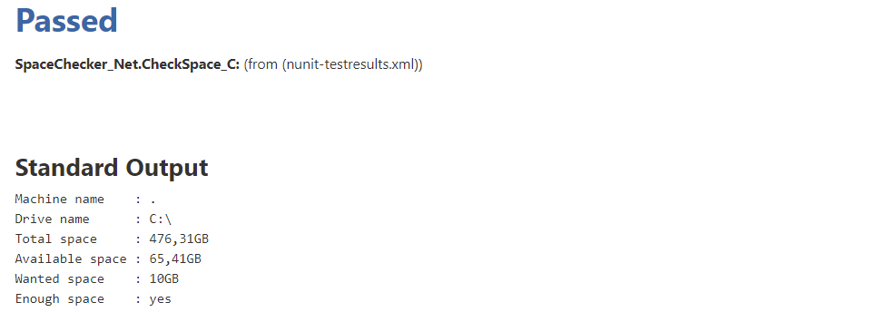
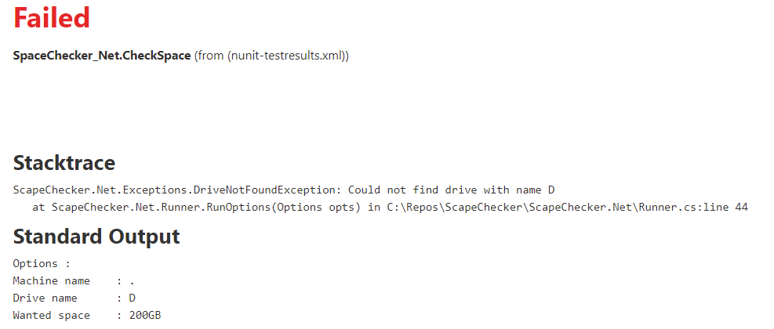

# spacechecker.net
A small tool to check if you have enough space left on a windows share, output in console and nunit format

## Jenkins screenshot of nunit reports

### No issues

### Drive not found

### Not enough space

### Wrong machine name

